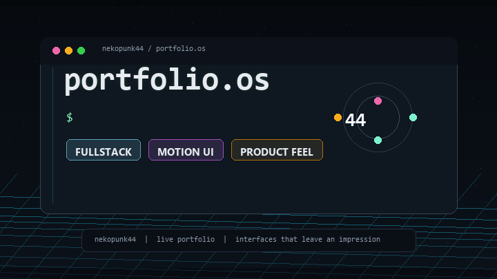

<p align="center">
  <a href="https://github.com/nekopunk44/nekopunk44/blob/main/README.md">
    
  </a>
  <a href="https://github.com/nekopunk44/nekopunk44/blob/main/README.ru.md">
    
  </a>
</p>

<p align="center">
  
</p>

<p align="center">
  <a href="https://nekopunk.vladbredihin4.workers.dev">
    
  </a>
  <a href="https://t.me/van_g0ck">
    
  </a>
  <a href="mailto:vladbredihin4@gmail.com">
    
  </a>
</p>

```txt
~/whoami
Vladislav Bredihin
Fullstack developer building product-style websites, motion-led interfaces,
and fullstack systems that need more than generic polish.
```

## `~/about`

I like projects that feel composed, memorable, and commercially sharp.

- Product-style frontend with stronger presentation
- Fullstack execution from idea to deploy
- Interfaces where motion and hierarchy actually matter
- Concepts that need both engineering and taste

## `~/selected-work`

- [Live portfolio](https://nekopunk.vladbredihin4.workers.dev)  
  Main showcase for my current terminal-style portfolio direction.

- [MomentumX](https://github.com/nekopunk44/MomentumX)  
  Agency-style platform focused on identity, offer framing, and stronger presentation.

- [ZenPulse-AI-Meditation-App-Prototype](https://github.com/nekopunk44/ZenPulse-AI-Meditation-App-Prototype)  
  Calm mobile product concept built around AI-oriented positioning and cleaner UX storytelling.

- [Avtotime](https://github.com/nekopunk44/Avtotime)  
  Larger fullstack platform scope with community, marketplace, and realtime flows.

<details>
  <summary><code>~/stack</code></summary>

  <br />

  `TypeScript` `React` `Next.js` `Node.js` `.NET` `MongoDB` `PostgreSQL` `Docker` `Three.js`
</details>

<details>
  <summary><code>~/current-focus</code></summary>

  <br />

  - Cleaner GitHub-facing case studies
  - Stronger frontend motion without template energy
  - Better visual identity across repos
  - Projects that feel like products, not dumps
</details>

## `~/reach-out`

- Telegram: [@van_g0ck](https://t.me/van_g0ck)
- GitHub: [github.com/nekopunk44](https://github.com/nekopunk44)
- Email: `vladbredihin4@gmail.com`

> I do not want projects to just work. I want them to leave an impression.
